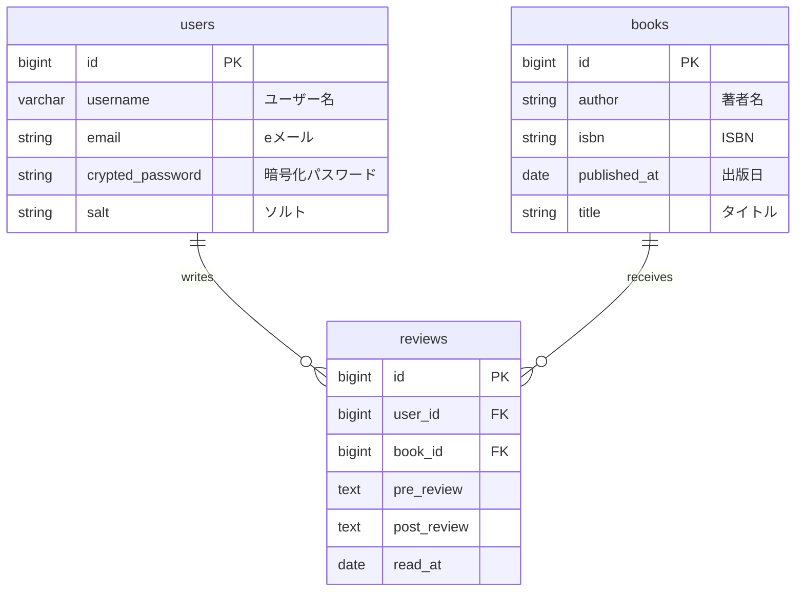

# yomiato

## 1. サービス概要

yomiatoは、本を読む前の「予想・妄想」と、読んだ後の「感想」を記録し、その違いを振り返る読書記録サービスです。

本の内容だけではなく、「自分はなぜそう思ったのか」「本を読んで何が変わったのか」に気づくことを目的としています。

---

## 2. このアイデアはどこから生まれたか

### 2-1. きっかけとなった体験・感情

『コンビニ人間』を読む前に、自分なりの「妄想レビュー」を書いたことがきっかけです。

読む前の自分は、

> 誰かに「普通」を押し付けられそうになったら、この本で殴り返そうと思う。
> 絶えず「普通」に苦しんでるなら、グローブぐらいにはなるだろう。

というように、この本を「普通を押し付けてくる社会に対抗するための本」だと予想していました。

しかし実際に読んでみると、単純に「普通に抵抗する話」とは感じませんでした。

白羽などの登場人物について考えていくうちに、

「普通から逃れようとしている自分も、結局は『普通』という価値観を基準にしているのではないか」

と考えるようになりました。

さらに、

「自分が考えていることも、その材料の多くは誰かから与えられたものなのではないか」

というところまで考えが広がりました。

読む前には想像していなかった方向に、自分の考えが変化していたことが印象に残りました。

---

### 2-2. なぜそれが「気になった」のか

もともと、自分は「普通」「常識」「当たり前」とされているものに違和感を持つことが多く、

* なぜ自分はそう考えているのか
* その前提は本当に正しいのか
* その考えは自分自身のものなのか

ということを考えることがあります。

一方で、自分自身も本や社会、学校、家族、メディアなどから多くの考え方を受け取っています。

そのため、

「自分らしい考えとは何なのか」

ということ自体に興味があります。

『コンビニ人間』を読む前と後で自分の考えが変化した経験から、

「本の内容」だけではなく、「本を読んだことで自分の考えがどう変化したのか」を記録できないかと考えました。

---

## 3. 課題の整理（表面的になっていないか）

### 3-1. 表に見えている困りごと

本を読んだ後には感想を書くことがありますが、読む前に自分が何を考えていたのかを残していないため、

* 読む前はどんなことを予想していたか
* 何に驚いたのか
* どこで考えが変わったのか

が後から分からなくなります。

また、読後の感想も「面白かった」「勉強になった」といった記録だけで終わってしまうことがあります。

---

### 3-2. 本当に解決したい課題は何か

**なぜ？①**

読書前の考えを忘れてしまうと、本を読む前と読んだ後で自分がどう変わったのか分からない。

**なぜ？②**

自分の考えがどう変化したのか分からないと、「自分はなぜこの本に影響されたのか」まで振り返ることができない。

**なぜ？③**

本の感想だけを記録していると、本そのものについて考えた記録にはなっても、「本を通して自分がどう考えたか」という記録が残らない。

→ **本当に解決したい課題：**

本を読んだという経験を、本の感想だけで終わらせず、**自分の価値観や考え方の変化に気づく機会にしたい。**

---

## 4. 想定ユーザーについて

### 4-1. 想定しているユーザー

#### 年齢設定

* 年齢：10〜40代
* 理由：

ある程度読書経験があり、「本の内容を知る」だけではなく、「自分はなぜこの本を面白いと思ったのか」「なぜこの考えに引っかかったのか」といった、自分自身の思考にも興味を持つ人を想定しています。

#### 生活・状況設定

* 生活・状況：

仕事や生活の中で忙しく過ごしながらも、休日や空いた時間に小説・エッセイ・哲学などを読む人。

読書後に感想を残す習慣はあるものの、読書前の予想まで記録することはあまりない。

* 理由：

本を読み始める前に数分だけ「この本についてどう思っているか」を記録し、読み終わった後に比較することで、普段なら気づかない自分の思い込みや考えの変化を振り返ることができます。

#### 環境設定

* 環境：

スマートフォンやPCからAIサービスや読書サービスを利用している。

* 理由：

読前・読後の文章を入力するだけで利用できるため、特別な道具を必要とせず、自分の読書の流れに組み込むことができます。

---

### 4-2. 自分とユーザーの距離

**自分自身**

自分自身が『コンビニ人間』を読む際に、実際に「読む前の予想」と「読後の考えの変化」を経験したことが、このサービスの出発点になっています。

まずは自分自身が使いたいと思えるものを作ることを目指します。

---

### 4-3. 実際に使われる可能性について（需要・存在確認）

まず最初に使ってくれそうなのは、

* 読書が好きな人
* 小説や文学を読む人
* 読書メモを残している人
* 読んだ本について深く考えたい人
* 自分の考え方や価値観について考えることがある人

などです。

特に、読書後にSNSや読書サービスへ感想を書いている人であれば、「読む前はどう思っていたか」という記録にも興味を持つ可能性があります。

現在の代替手段としては、

* 読書メーター
* ブクログ
* Notion
* SNS
* 自分で作った読書メモ
* ChatGPTなどのAIチャット

があります。

ただし、これらは基本的に「本について記録・共有する」ことが中心です。

yomiatoでは、「本について何を書いたか」だけではなく、**読む前と読んだ後で自分の考えがどう変化したか**を記録することに重点を置きます。

---

## 4-4. ユーザーがサービスを導入して利用するまでのイメージ

### 利用開始

「これからこの本を読む」というタイミングでサービスを思い出します。
本を登録し、読む前に簡単な「妄想レビュー」を書きます。
例えば、

* この本はどんな話だと思うか
* 何をテーマにした本だと思うか
* 自分は何を期待しているか

などを自由に書きます。

### 読了後

本を読み終わったら、通常の読後レビューを書きます。

その後、読前と読後の内容を比較します。

### 継続利用

一冊だけではなく複数の本について記録することで、

* 自分はどんな本で予想を外しやすいのか
* どんなテーマに反応しやすいのか
* どんな価値観を持っているのか
* どんな考え方が本によって変化しやすいのか

といった傾向が見えてくることを目指します。

---

## 5. 既存サービス・競合調査

### 5-1. 似たサービスの調査

* サービス名：読書メーター
* URL：[読書メーター](https://bookmeter.com/?utm_source=chatgpt.com)
* どんなことができるか：

読んだ本を登録して読書量を管理したり、感想・レビューを投稿したり、他の読書家と交流したりできます。読書量のグラフ化や、本を「読みたい」「積読」「読んでる」「読んだ」などの状態で管理する機能もあります。

### 5-2. それでも自分が作りたい理由

読書メーターのようなサービスでは、本を読んだ記録や感想を残すことができます。
しかし、自分が『コンビニ人間』で経験した、
「読む前にはこう思っていたが、読んでみたら全く違うことを考えていた」
という変化そのものを記録することには重点が置かれていません。
自分が作りたいのは、「この本をどう評価したか」を残すサービスではなく、

**「この本を読むことで、自分はどう考え方が変わったのか」を残すサービス**

です。

---

### 5-3. 差別化を「体験価値」で表現する

* 私のアプリの差別化ポイント：

**本を読む前の自分の思い込みに気づき、本を読み終えた後に「自分はなぜこう考えるようになったのか」を振り返れること。**

「本についてレビューを書く」のではなく、

**「本を読むことで、自分自身について発見する」**

という体験を提供します。

---

## 6. このサービスで提供したい価値

### 6-1. ユーザーの変化

* 行動の変化：

本を読む前にも、自分がその本について何を考えているのかを記録するようになる。

* 気持ちの変化：

「予想が外れた」「読み違えた」を失敗として捉えるのではなく、自分の思い込みを発見するきっかけとして捉えられるようになる。

* 考え方の変化：

「自分はなぜそう考えたのか」「何が自分の考えを変えたのか」を振り返るようになる。

---

### 6-2. 価値を一文で表す

**このサービスは、本を深く考えたい人が、読前と読後の「読み違い」を通して、自分自身の価値観や思考の変化に気づけるようになるサービスです。**

---

## 7. このアプリで実現すること

### MVPで作る機能

* ユーザー登録・ログイン
* 本の登録
* 本の一覧・選択
* 読前レビューの投稿
* 読後レビューの投稿
* 読前・読後レビューの保存
* 読前・読後レビューの比較
* AIによる読み違いの分析

### 本リリースで作る機能

* 読書履歴の管理
* 読前・読後の変化の可視化
* 複数の本を横断した思考傾向の分析
* 過去のレビューの振り返り
* 読書メモの記録
* 読書記録を継続するための仕組み
* 外部APIからの書籍情報取得

---

## 8. このアプリの懸念点とその対策

### 懸念点①

* 何が問題になりそうか：

「わざわざ読前レビューを書くのが面倒」と感じて、最初の段階で利用をやめてしまう可能性がある。

* なぜそう思うか：

読書を始めるだけでも手間がある中で、さらにサービスに文章を書く必要があるため。

また、「読前に何を書けばいいのか分からない」という問題も考えられます。

* そのために考えている対策：

最初から長い文章を書くことを求めず、短い文章でも記録できるようにする。

例えば、

「この本はどんな話だと思う？」
「何を期待している？」
「読んだらどうなりそう？」

など、考えるきっかけになる質問を用意する。

また、将来的にはAIを利用して、入力された内容からさらに考えを深掘りできるようにする。

---

## 9. 今後の展開・発展の方向性

### 今考えている発展案

* 機能追加の方向性：

読前・読後の比較だけではなく、複数の本の記録を横断して、自分がどんなテーマや考え方に反応しているのかを分析する。

また、読書中に思いついたことを簡単に残せる「読書メモ」の機能も追加する。

* UI・体験の改善：

本を読むたびに記録が積み重なっていく感覚を持てるようにする。

例えば、GitHubのContribution Graphのように、読書や読書メモが積み重なっていくことを視覚的に確認できる仕組みを検討する。

* 機能以外の工夫：
「読み違い」を失敗として扱わない。
むしろ、

**「予想が外れたからこそ、自分が何を前提に考えていたのかが分かった」**

と捉えられるようなサービスにする。
将来的には、複数の本を読んだ記録から、
「100冊読んだ結果、私は結局何について考え続けていたんだろう？」
という問いに答えられるようなサービスを目指す。

---

## 10. 技術スタック（手段としての技術）

### 10-1. 使用予定の技術

* フレームワーク：Ruby on Rails
* DB：PostgreSQL
* デプロイ先：未定
* 使用予定ライブラリ：

  * 外部書籍API
  * AI API

## ER図

